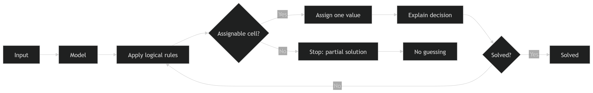
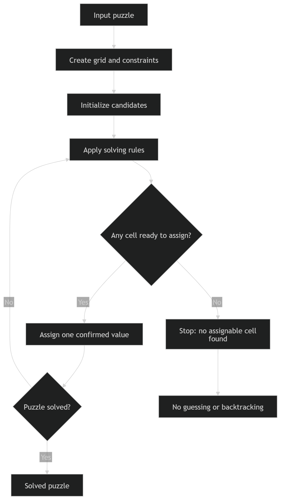

# Sudoku Solver

A sudoku solver using constraint propagation. Supports both standard sudoku and **chaos sudoku**, a variant where the nine groups are irregular shapes rather than fixed 3×3 boxes.

## Setup

Requires Python 3.11.5 and [uv](https://docs.astral.sh/uv/).

```bash
uv sync
```

## Overview



## Interactive solver

Solve a puzzle step by step in the terminal:

```bash
uv run sudoku-solver
```

On startup, choose a puzzle:

```
Select a puzzle to solve:
  1  Chaos Sudoku #3
  2  Chaos Sudoku #4
  3  Random puzzle from Kaggle dataset
```

The solver works through the puzzle one assignment at a time, printing the grid after each step and showing which rule determined the placed value:

```
Cell (4, 2) → 7  [hidden single]
```

## Evaluator

Run the solver against a batch of Kaggle puzzles and get statistics:

```bash
uv run sudoku-evaluate data/sudoku.csv
uv run sudoku-evaluate data/sudoku.csv --batch-size 5000
```

Reports two things:

- **Solve rate** — how many puzzles were fully solved
- **Rule usage** — how often each rule was the deciding factor for an assignment

To save puzzles the solver could not finish, pass `--output`:

```bash
uv run sudoku-evaluate data/sudoku.csv --output stuck.csv
```

The output CSV contains three columns: `puzzle` (original), `partial` (state when stuck), and `solution` (when available).

Expected runtime is roughly **11ms per puzzle**.

## Kaggle dataset

The evaluator and the interactive solver's random-puzzle option both require the [9 Million Sudoku Puzzles](https://www.kaggle.com/datasets/rohanrao/sudoku) dataset.

### Authentication

Get your API token from [kaggle.com/settings](https://www.kaggle.com/settings) → API → "Create New Token". Then authenticate using one of the methods below.

**OAuth (recommended — works on all platforms):**

```bash
uv run kaggle auth login
```

This opens a browser, saves a token locally, and requires no further setup.

**`.env` file (Windows / cross-platform):**

Create a `.env` file in the project root:

```
KAGGLE_API_TOKEN=your_token_here
```

Then load it into your current shell session before running any `uv run` commands:

```powershell
. .\load_env.ps1
```

The leading `. ` (dot space) is important. Without it, the variables are only set inside the script and are gone by the time it finishes.

**Environment variable (bash / Linux / macOS):**

```bash
export KAGGLE_API_TOKEN=your_token_here
```

### Downloading

```bash
uv run sudoku-download                             # saves to data/
uv run sudoku-download --output-dir <path>         # custom location
uv run sudoku-download --force                     # re-download if already present
```

## Docker

Build the image:

```bash
docker build -t sudoku-solver .
```

Download the dataset once (requires `KAGGLE_API_TOKEN`):

```bash
uv run sudoku-download
```

Run the evaluator, mounting `data/` into the container:

```bash
docker run --rm -v "./data:/data" sudoku-solver
docker run --rm -v "./data:/data" sudoku-solver /data/sudoku.csv --batch-size 500
docker run --rm -v "./data:/data" sudoku-solver /data/sudoku.csv --output /data/stuck.csv
```

## Development

```bash
# Lint and auto-fix
uv run ruff check --fix src/
uv run ruff format src/

# Type-check
uv run mypy src/
```

## Tests

```bash
uv run pytest
```

The test suite covers:

- Unit tests for each constraint-propagation strategy (`tests/unit/strategies/`)
- Unit tests for `Puzzle.is_valid_solution` (`tests/unit/test_puzzle.py`)
- Integration tests for the two built-in chaos puzzles and a 20-puzzle sample from the Kaggle dataset (`tests/test_puzzles.py`)

## How the solver works



Each empty cell starts with candidates `{1–9}`. After every value is placed, `reduce_candidates()` runs a pipeline of constraint-propagation rules in order:

| Rule | Description |
|---|---|
| Row / column / group elimination | Remove a placed value from peers in the same row, column, and group |
| Naked pairs / triples / quads | If N cells in a unit share exactly N candidates, remove those from all other cells in that unit |
| Hidden singles | If a candidate appears in only one cell within a unit, lock that cell to that candidate |
| Hidden pairs | If two candidates each appear in exactly the same two cells of a unit, restrict those cells to only those two candidates |
| X-wing | If a candidate appears in exactly two cells in each of two rows, and those cells share the same two columns, eliminate the candidate from all other cells in those two columns (and vice versa for columns) |
| Swordfish | Generalisation of X-wing to three rows: if a candidate appears in 2–3 cells in each of three rows and the union of column positions is exactly three, eliminate the candidate from all other cells in those three columns (and vice versa for columns) |
| Pinned candidates | If all cells holding a candidate within a group share a row or column, eliminate that candidate from the rest of that row/column |
| Box/line reduction | If all cells holding a candidate within a row or column belong to the same group, eliminate that candidate from the rest of that group |

`solve_step()` picks a random cell that has been reduced to a single candidate, places the value, and triggers another round of reduction. Each placed value records the rule that narrowed it to one candidate (`Cell.deciding_rule`). The process repeats until the puzzle is solved or no more naked singles remain.

`Puzzle.is_valid_solution` can be used to verify that a completed grid satisfies all constraints — every row, column, and group contains each digit 1–9 exactly once.

> **Note:** the solver uses constraint propagation only — there is no backtracking. Puzzles that require guessing will stall.

### Known limitations

**Hidden pair is invisible to the rule statistics.** A rule is credited for an assignment only when it reduces a cell to exactly one candidate. Hidden pair always narrows a cell to exactly two candidates — the pair itself — so it can never be the final step that produces a naked single. If hidden pair is a necessary intermediate step, the rule that subsequently reduces one of those two candidates to a single gets the credit instead. This means the evaluator's rule usage table systematically underreports hidden pair's contribution.

## Adding puzzles

Puzzles are represented as a `PuzzleData` named tuple with two required fields: `values` (initial numbers, `0` for empty) and `groups` (group ID `0–8` per cell). Standard 3×3 box groups are the default when `groups` is omitted.

```python
from sudoku_solver.puzzles import PuzzleData

my_puzzle = PuzzleData(
    values=[[0, 0, 3, ...], ...],
    groups=[[0, 0, 0, ...], ...],  # omit for standard sudoku
)
```

See [src/sudoku_solver/puzzles/chaossudoku_3.py](src/sudoku_solver/puzzles/chaossudoku_3.py) for a full example.
